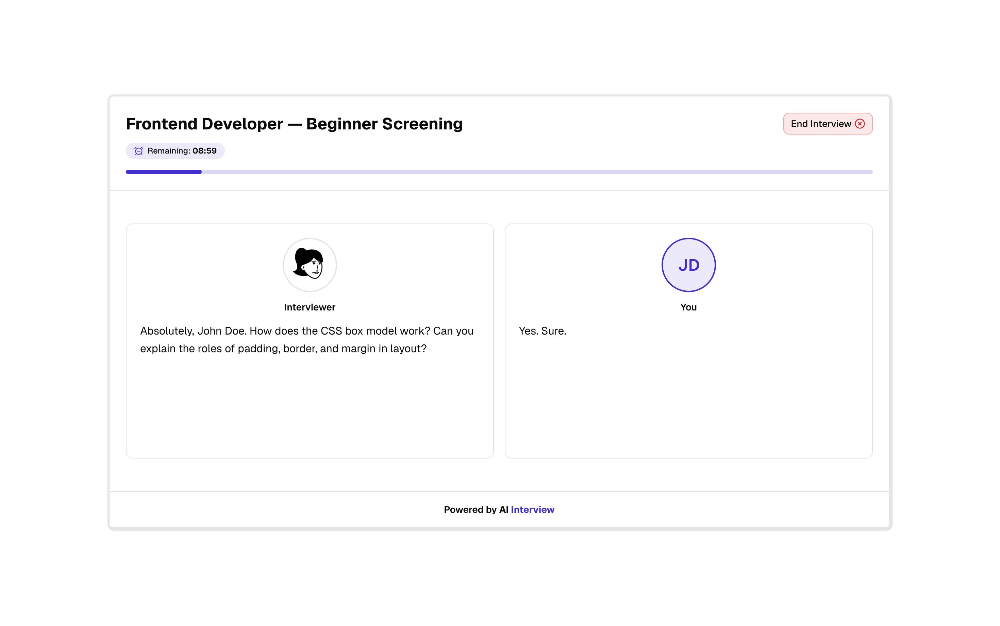

# AI Interview &middot;  

Open-source AI voice interview platform — paste a job description, send candidates a link, and get back a full scorecard automatically.

## Features

- **Create an interview** — Paste a job description or upload a PDF. The AI writes tailored questions and lets you pick an interviewer persona.
- **Share a link** — Send candidates a link. No sign-up or install needed on their end.
- **AI voice interview** — Candidates join a live AI voice call at their convenience. Tab switches are flagged automatically.
- **Candidate pipeline** — Track every candidate's status and move them through stages from the dashboard.
- **Review results** — Get a scorecard on communication, technical fit, and overall impression minutes after the call. Track completion rates and sentiment trends across all interviews.

## Tech Stack

- Next.js 16 (App Router)
- Better Auth
- Drizzle ORM + PostgreSQL
- Retell AI + OpenAI + LangChain
- shadcn/ui + Tailwind CSS

## Contributing

Please read the [contributing guide](CONTRIBUTING.md).

## License

Licensed under the [MIT license](LICENSE).
